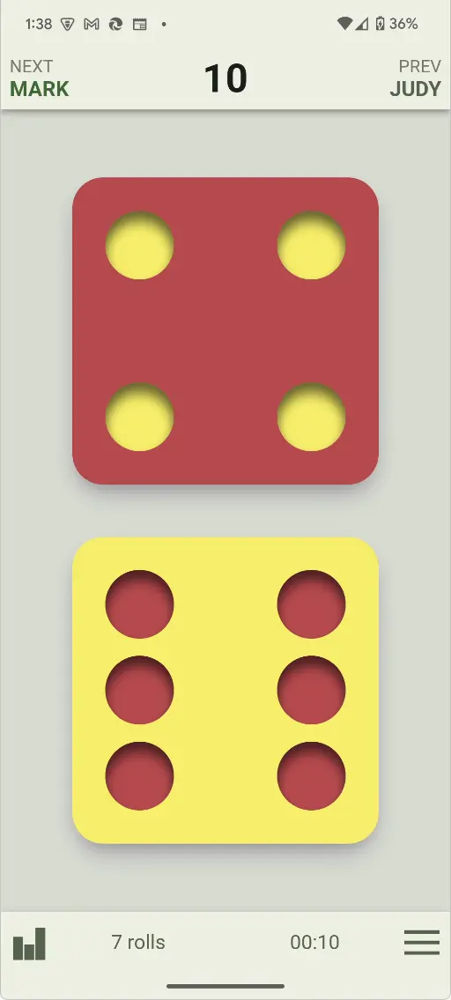
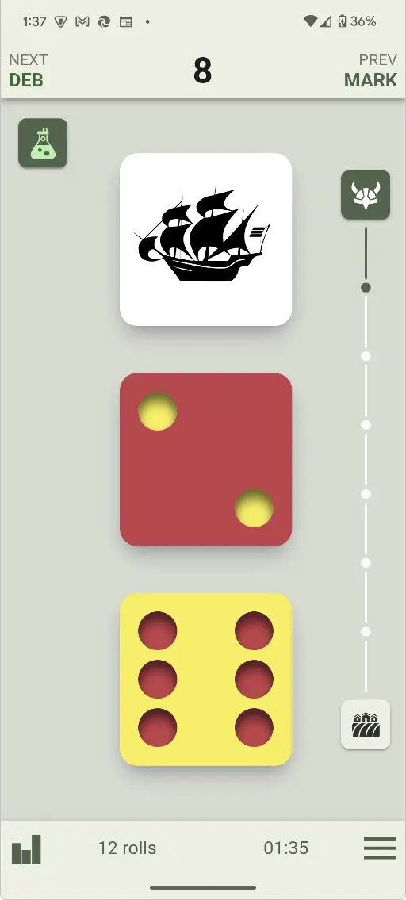
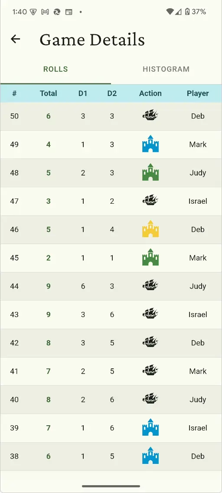
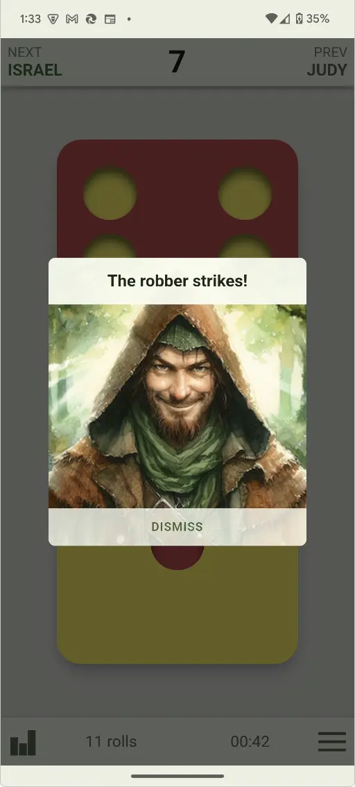

# Catan Dice

A Progressive Web App (PWA) dice roller for Catan board game, built with Angular and Ionic.

## Screenshots


<p>
  
  
  
  
</p>

## Features

- **Dice Rolling** - Roll dice for Catan with animated results and sound effects
- **Fair Dice Mode** - Guarantees a statistically normal distribution over 36 rolls, eliminating unlucky streaks
- **Game Expansions** - Supports Seafarers and Cities & Knights expansions (including the red event die)
- **Player Management** - Track multiple players across games
- **Game History** - View past games and roll statistics
- **Player Statistics** - Track individual player stats including:
  - Games played and won
  - Roll histograms
  - Robber roll counts
  - Win streaks
  - Fastest wins
- **Cloud Sync** - Sign in with email to sync your data across devices
- **Dark Mode** - Automatic dark/light theme based on system preference

## Tech Stack

- **Angular 19** - Frontend framework
- **Ionic 8** - UI components and mobile-first design
- **Firebase** - Authentication (email link) and Firestore for cloud sync
- **Dexie.js** - IndexedDB wrapper for local data persistence
- **Swiper** - Touch-friendly carousels

## Getting Started

### Prerequisites

- Node.js 18+
- npm or yarn

### Installation

```bash
# Install dependencies
npm install

# Start development server
npm start
```

The app will be available at `http://localhost:4200`

### Build for Production

```bash
npm run build
```

Output will be in `www/catandice/`

### Deploy to Firebase Hosting

```bash
# Login to Firebase (first time only)
firebase login

# Build and deploy
npm run deploy
```

## Project Structure

```
src/
├── app/
│   ├── auth/           # Login page and authentication
│   ├── game/           # Game management and history
│   ├── home/           # Home page
│   ├── play/           # Dice rolling playground
│   ├── player/         # Player management and stats
│   ├── settings/       # App settings
│   └── shared/         # Shared services, types, and utilities
│       ├── auth.service.ts    # Firebase authentication
│       ├── database.ts        # Dexie IndexedDB setup
│       ├── firebase.ts        # Firebase initialization
│       ├── sync.service.ts    # Cloud sync logic
│       └── types.ts           # TypeScript interfaces
├── assets/
│   ├── fonts/          # Custom fonts
│   ├── images/         # Game images
│   ├── sounds/         # Sound effects
│   └── svg/            # Icon SVGs
├── environments/       # Environment configurations
└── theme/              # Ionic theme variables
```

## Configuration

### Firebase Setup

1. Create a Firebase project at [console.firebase.google.com](https://console.firebase.google.com)
2. Enable **Authentication** with Email Link (passwordless) sign-in
3. Enable **Firestore Database**
4. Add your Firebase config to `src/environments/environment.ts` and `environment.prod.ts`
5. Set up Firestore security rules:

```javascript
rules_version = '2';
service cloud.firestore {
  match /databases/{database}/documents {
    match /users/{userId}/{document=**} {
      allow read, write: if request.auth != null && request.auth.uid == userId;
    }
  }
}
```

### Firebase Hosting

The app is configured to deploy to a `/catandice` subdirectory. See `firebase.json` for hosting configuration.

## Scripts

| Command | Description |
|---------|-------------|
| `npm start` | Start development server |
| `npm run build` | Build for production |
| `npm run deploy` | Build and deploy to Firebase |
| `npm run lint` | Run ESLint |
| `npm test` | Run unit tests |

## License

Private - All rights reserved

## Author

Israel Dryer
